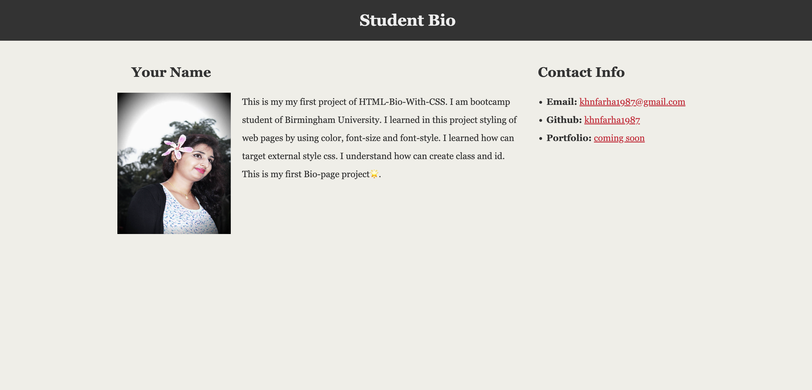

# HTML-Bio-With-CSS

# Reference the `style.css` in the `html-bio-with-css.html` file.

# Add a `class` called "container" on the `div` tag. For example: `
`.

# Add an `id` called "main-bio" for the first `section` tag.

# Add an `id` called "contact-info" for the second `section` tag.

# Add an `id` called "bio-image" for the bio image.

# styling of CSS:
 * body section: Create background color; font style; font color; padding; margin.
 * target id's by using different width and styled.
 * target h1, h2 and links to change color.
  
# Application screenshots:
